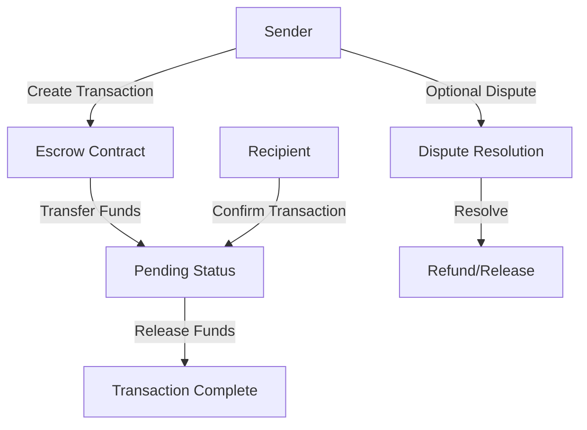

# Sync Distributor - Trustless Transaction Synchronization

A secure, decentralized platform for synchronized transactions with built-in escrow and dispute resolution mechanisms on the Stacks blockchain.

## Overview

Sync Distributor provides a robust, transparent system for managing transactions with:

- Trustless escrow mechanism
- On-chain transaction tracking
- Dispute resolution framework
- Secure fund management

## Architecture



### Core Components

1. **Transaction Management**: Track and synchronize transactions
2. **Escrow Mechanism**: Secure fund holding and release
3. **Dispute Resolution**: Fair conflict management process

## Getting Started

### Prerequisites

- Clarinet
- Stacks wallet
- STX tokens

### Basic Usage

#### Creating a Transaction

```clarity
(contract-call? .sync-distributor create-transaction
    recipient-address
    u1000000 ;; Amount in microSTX
    "Transaction Metadata"
)
```

#### Confirming a Transaction

```clarity
(contract-call? .sync-distributor confirm-transaction
    transaction-id
)
```

## Function Reference

### Transaction Management

```clarity
(create-transaction 
    (recipient principal) 
    (amount uint) 
    (metadata (string-utf8 500))
)
(confirm-transaction (transaction-id uint))
```

### Dispute Resolution

```clarity
(initiate-dispute 
    (transaction-id uint) 
    (reason (string-utf8 500))
)
(resolve-dispute-refund (transaction-id uint))
```

## Development

### Testing

1. Clone repository
2. Install Clarinet
3. Run tests:
```bash
clarinet test
```

### Local Development

1. Start Clarinet console:
```bash
clarinet console
```

2. Deploy contracts:
```bash
clarinet deploy
```

## Security Considerations

### Known Limitations

- Dispute resolution relies on participants
- Fixed dispute resolution window
- Requires active participant engagement

### Best Practices

1. Verify transaction details before confirmation
2. Use clear, concise transaction metadata
3. Monitor transaction status
4. Understand dispute resolution mechanism
5. Keep transaction amounts reasonable

## License

[Add appropriate license here]